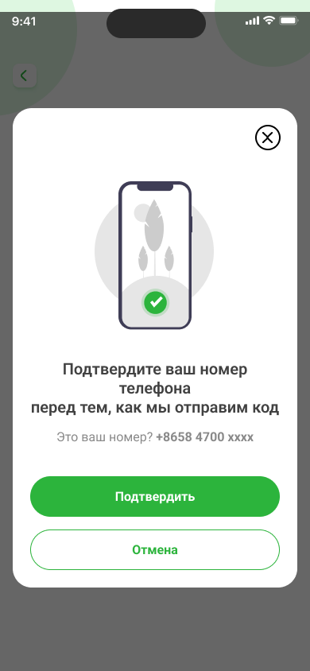

# Регистрация в NovaBank

В NovaBank можно зарегистрироваться по номеру телефона.

## Регистрация

1. На главном экране приложения NovaBank нажмите кнопку **Регистрация**.
2. Откроется экран для создания аккаунта — заполните все поля, примите условия пользовательского соглашения и нажмите кнопку **Зарегистрироваться**. 

3. Подтвердите номер телефона через кнопку **Подтвердить**.

4. Система отправит SMS с кодом подтверждения на ваш номер телефона. 
5. Введите полученный код в появившееся поле. Если код не пришёл, нажмите кнопку **Отправить повторно**.
6. Нажмите кнопку **Подтвердите номер телефона**.

7. После успешного ввода кода появится экран с сообщением **Готово! Номер подтверждён**.
8. Нажмите кнопку **Перейти в приложение** для завершения регистрации и входа в свой новый аккаунт.

После успешной регистрации вы сможете войти в личный кабинет, используя номер телефона и установленный пароль.

## Авторизация через Госуслуги в Nova Bank

Вы можете авторизоваться в Nova Bank через Госуслуги:

1. Нажмите на иконку Nova Bank на главном экране вашего устройства.
2. Выберите **Войти в аккаунт**.
3. Нажмите на значок меню и выберите **Госуслуги**.
4. Введите свои учётные данные для Госуслуг и проверьте их актуальность.
5. Нажмите **Войти**.
6. На ваш номер придёт SMS с кодом подтверждения.
7. Введите код и нажмите **Продолжить**.
8. При необходимости введите пароль от вашего аккаунта или подтвердите вход через push-уведомление.
9. Нажмите **Продолжить** для завершения авторизации.

**Читайте также:**

- [Как перевести деньги по номеру карты](../payments/transfers.mdx)
- [Просмотр баланса и транзакций](../balance.mdx) 
- [Как восстановить пароль в Nova Bank](change-password.mdx)
